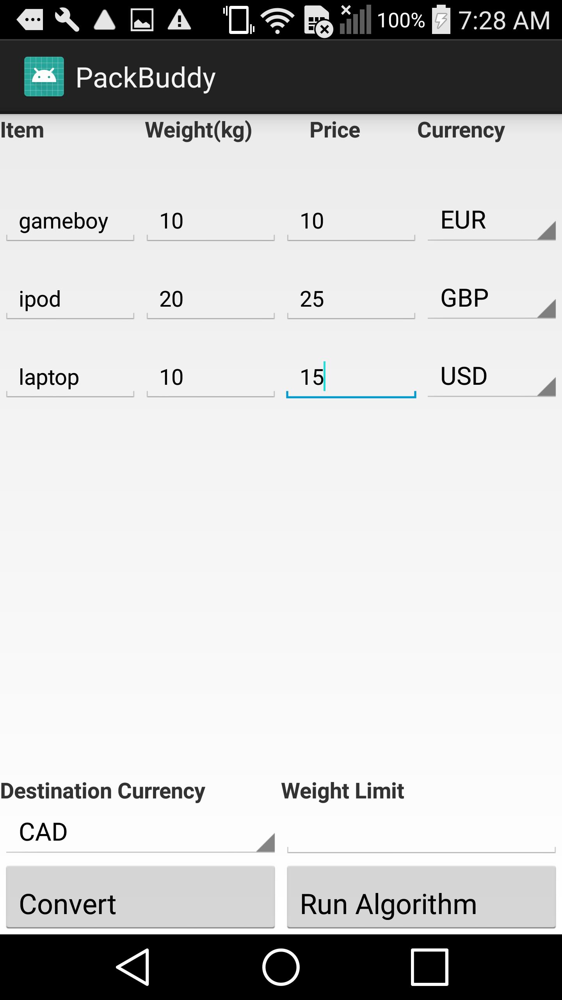

# PackBuddy
If you ever find yourself in a situation where you need to store a certain number of objects in a limited space (like a backpack or suitcase) but don't have enough space to store everything, PackBuddy is your **buddy**! More specifically, if you are travelling and all of your items were bought with different currencies, PackBuddy converts everything for you and tells you which souvenirs to keep, and which to sadly throw away at the airport. But hey, maybe next time you'll learn not to keep that 3kg rock you found in Peru because it was *lucky*.

## What it does
The Knapsack Problem is a problem in Combinatorial Optimization, where we have a certain number of objects, each with their own value and weight. We can't fit everything in our knapsack, so how do we pick our objects to maximize the amount of value of our knapsack?

Now imagine another layer of complexity - all the values of the objects are in different currencies (which would be very likely if you are travelling).

PackBuddy is able to take in all this information (name of the object, weight and value in any currency) and gives you the optimal packing arrangement to maximize your value. PackBuddy solves this through currency conversion and a general optimization algorithm.

## How we built it
Seeing as this use case would best be suited for a mobile app, we built PackBuddy as an Android App. Currency Conversion was implemented using XE's Currency Data API and we used a general purpose optimization algorithm to solve the Knapsack problem, with a few of our own modifications.

## Screenshots

